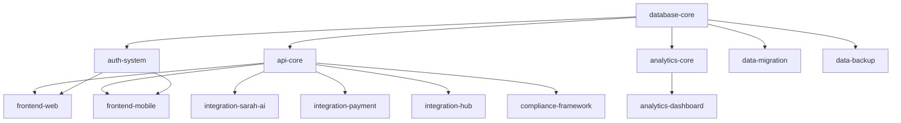

# SMRT CRM Platform - Modules Directory

This directory contains Git submodules for each development component of the SMRT CRM Platform. Each module is developed in its own repository to enable parallel team development.

## Module Structure

### Core Infrastructure
- **database-core/** - Core database schema, migrations, and data access layer
- **api-core/** - FastAPI backend with authentication and business logic (Part 2)
- **auth-system/** - Multi-tenant authentication and authorization system (Part 11)

### User Interfaces  
- **frontend-web/** - Web application interface (React/Vue/Svelte) (Part 1)
- **frontend-mobile/** - Mobile application (React Native)

### Integration Systems
- **integration-sarah-ai/** - Sarah AI calling system integration (Part 4)
- **integration-payment/** - Payment processing integrations
- **integration-hub/** - Unified third-party integration management (Part 9)

### Analytics and Intelligence
- **analytics-core/** - Business intelligence and reporting engine (Part 5)
- **analytics-dashboard/** - Real-time metrics and visualization interface

### Data Management
- **data-migration/** - ETL tools and legacy data import (Part 7)
- **data-backup/** - Backup, archival, and disaster recovery systems

### Compliance and Security
- **compliance-framework/** - TCPA, GDPR, and consent management systems

### DevOps and Infrastructure
- **devops-deployment/** - Docker, Kubernetes, CI/CD pipelines (Part 6)
- **devops-monitoring/** - Monitoring, alerting, and log aggregation

## Working with Modules

### Initial Setup
```bash
# Clone all submodules
git submodule update --init --recursive

# Or clone specific module
git submodule update --init modules/api-core
```

### Adding New Module
```bash
# Add submodule (done by infrastructure team)
git submodule add git@github.com:smrt-crm/new-module.git modules/new-module

# Commit submodule addition
git add .gitmodules modules/new-module
git commit -m "Add new-module submodule"
```

### Updating Module References
```bash
# Update to latest commit in submodule
cd modules/api-core
git pull origin main
cd ../..
git add modules/api-core
git commit -m "Update api-core to latest version"
```

### Development Workflow
1. **Check out module** using the module checkout system
2. **Clone module repository** into appropriate directory
3. **Develop in module** following project standards
4. **Test integration** with other modules
5. **Complete module** and create integration PR

## Module Dependencies



## Integration Testing

```bash
# Run integration tests for specific module
../scripts/test-integration.sh api-core

# Run full integration test suite
../scripts/test-integration.sh all
```

## Module Standards

Each module must include:
- **README.md** - Module overview and setup instructions
- **requirements.txt** or **package.json** - Dependencies
- **tests/** - Comprehensive test suite
- **docs/** - API documentation and integration guides
- **.env.example** - Environment variable template

## Coordination

Use the module checkout system to prevent development conflicts:

```bash
# Check what's currently being worked on
../scripts/checkout.sh list-active

# Reserve a module for development
../scripts/checkout.sh checkout module-id "Your Name" "email" days "reason"
```

---

For detailed information about each module, see the README.md file within each module directory after it's been cloned.